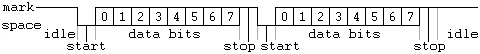
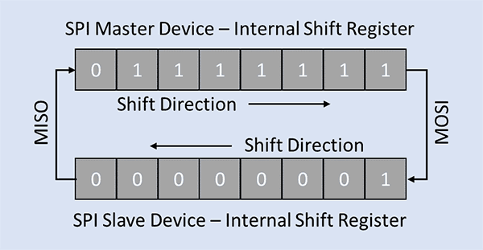
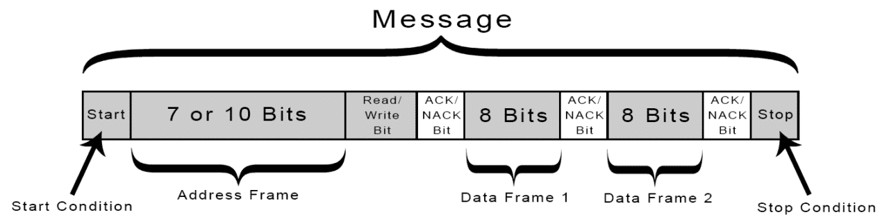
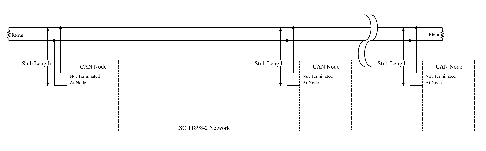
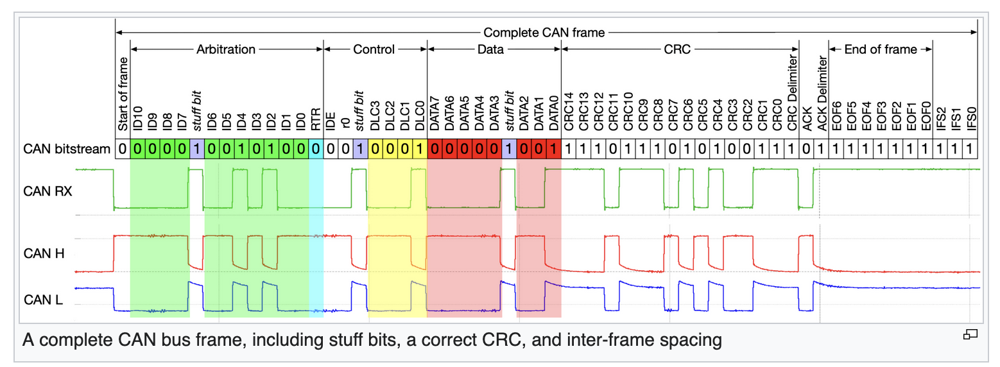
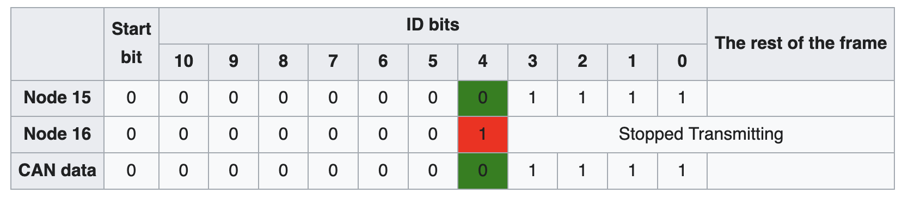
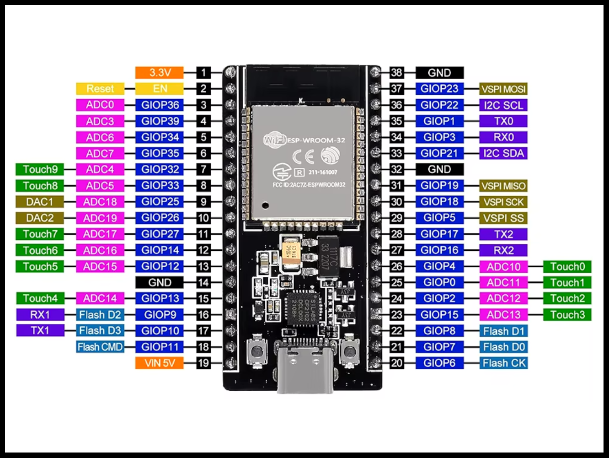

% Serial Communication Formats
% Joe <kamikazejoe@gmail.com> & Rob <robert@rtward.com>
%<br/>Talk: [${TALK_URL}](${TALK_URL})<br/>Repo: [${REPO_URL}](${REPO_URL})

# Serial Communication Formats

::: notes

Some speaker notes here

:::

# RS-232 et al.

## Overview

 - _Standard_ Serial Port
 - Originally designed for modems
 - Only point-to-point

## Diagram
 ```
    -------------------
    | Data Terminal   |
    | Equipment (DTE) |
    -------------------
            |
----------------------------
| Data Circuit-Terminating |
| Equipment (DCE)          |
----------------------------
```

## Pinout - All

 - Data Terminal Ready
 - Data Carrier Connect
 - Data Set Ready
 - Ring
 - Request to Send
 
## Pinout - All

 - Ready to Receive
 - Clear to Send
 - Tx
 - Rx
 - Ground

## Pinout - Required

 - Tx
 - Rx
 - Terminal Ready
 - Set Ready
 - Ground

## Signalling

 - Pin driven high for 1
 - Pin driven low for 0
 - 3-15v diff

## RS-422

 - Often used as an extender
 - Runs on two twisted pairs + ground
 - Voltage diff on each pair for signal
 - Still point-to-point (kinda)
 
::: notes

 - Spec allows for multiple receivers on a single twisted pair, but only one driver.

:::

## RS-485

 - Similar to 422
 - Supports multiple devices on a single pair
 - Was the SCSI transmission protocol
 - Heavily used on model trains

::: notes

 - Can actually interoperate with 422 in some cases
 - Also used to extend 232 connections

:::

## 422 / 485 Pinout

```
  Device A                              Device B
  --------                              --------
            ~~~~~~~~~~~~~~~~~~~~~
   TX+ ----~  Twisted Pair 1    ~---- RX+
   TX- ----~                    ~---- RX-
            ~~~~~~~~~~~~~~~~~~~~~

            ~~~~~~~~~~~~~~~~~~~~~
   RX+ ----~  Twisted Pair 2    ~---- TX+
   RX- ----~                    ~---- TX-
            ~~~~~~~~~~~~~~~~~~~~~
```

## 422 / 485 Signaling

 - Wires are driven apart
 - +/- 200mv min
 - +/- 6v max

# UART

Universal Asynchronous Receiver-Transmitter

::: notes

- One of the oldest and simplest methods for devices to communicate
- No shared clock. Which is why it's "Asynchronous"
- Instead, there is an agreed upon baud rate.
- Is slow, anywhere between 300 to 115200 bps (though usually 9600 or above)

:::

## Uses

- Microcontrollers
- Rasberry Pis
- Bluetooth Modules
- GPS Modules

::: notes

- Not just Respberry Pis
- Pretty much any System-on-Chip
- How you get console access
- Goes over the aformentioned RS standards

:::

## Signaling



::: notes

- Devices must agree upon:
- Voltages
- Baud Rate
- Parity bits
- Data bit size
- Stop bit size
- Flow control

:::

## Wiring

```
TX ------------> RX
RX <------------ TX
```

::: notes

- Wiring is dead simple
- Which is why it's so widely used
- Could scale down even more with HDUART

:::

# SPI

Serial Peripheral Interface

::: notes

- Opposite  of UART
  - Much faster.
    - Speed is determined by it's Clock rate.
    - There's no specified maximum.
    - Limited by hardware
- Designed to allow multipled devices to connect to the same controller

:::

## Uses

- SD Cards
- Flash Memory
- Small LCD Displays

::: notes

- SD Cards have built in SPI interface for slower access
- Flash Memory, DACs, ADCs, LCD Displays
- All kinds of components

:::

## Signaling



::: notes

- Has dedicated lines for input and output
- Allows for full-duplex transmission
- Data frames are either 8 or 16 bit in size
- Data is ordered by eitehr MSB or LSB
- So data pretty much just shifts back and forth at clock speed

:::

## Wiring
```
+----------------+                    +-------------------+                      
|                |                    |                   |                      
|            SCLK|----------------+-> |  SCLK             |                      
|            MOSI|-------------+----> |  MOSI   Device 1  |                      
|   MAIN     MISO|<---------+-------- |  MISO             |                      
|            CS1 |------------------> |  CS               |                      
|            CS2 |--------+ |  |  |   |                   |                      
|            CS3 |------+ | |  |  |   +-------------------+                      
|                |      | | |  |  |                                              
+----------------+      | | |  |  |   +-------------------+                      
                        | | |  |  |   |                   |                      
                        | | |  |  +-> |  SCLK             |                      
                        | | |  +----> |  MOSI   Device 2  |                      
                        | | +-------- |  MISO             |                      
                        | +---------> |  CS               |                      
                        |   |  |  |   |                   |                      
                        |   |  |  |   +-------------------+                      
                        |   |  |  |                                              
                        |   |  |  |   +-------------------+                      
                        |   |  |  |   |                   |                      
                        |   |  |  +-> |  SCLK             |                      
                        |     | +----> | MOSI   Device 3 |
                        | --- |MISO             |                      
                        +-----------> |  CS               |                      
                                      |                   |                      
                                      +-------------------+                      
                                                                               
```

::: notes

- To wire up one device, you need a minimum of 4 wires
  - Main Out / Secondary In (MOSI)
  - Main In / Secondary Out (MISO)
  - Serial Clock (SCLK)
  - Secondary or Cable Select (SS/CS)
- For each additional device you need a dedicated CS line
- Wiring get complicated with many devices
- Limited by IO on the main controller

:::

# 1-Wire

 - Half Duplex Only
 - Each chip is uialt textque
 - Multi device
 - Two wires (data & ground)
 
## Uses

 - iButtons
 - Magsafe 
 - Power supplies
 
## Signaling

 - Wire is normally high (3-5v)
 - Signals work by pulling low
 - Short low = 1
 - Long low = 0

# I2C

Inter Integrated Circuit

::: notes

- I2C or I^2C
- Little bit UART, little bit SPI
- Slower than SPI, but easier to add components

:::

## Uses

- Sensors
- Small OLED Displays
- DACs and ADCs
- EEPROMs

::: notes

- Lots of sensors, including what's in your PCs
- Drives small OLEDs
- Extended Display Identification Data (EDID)
  - Identify monitor specs for VGA, DVI, and HDMI
  - Can hack a VGA port into an I2C port

:::

## Signaling



::: notes

- Typical voltages +3.3V to +5V
- Each devices has a 7-bit hardware address
- This allows for 127 devices connected by just two wires.
- Standar speed is around 100 kbps, but there are specs for up to 5 Mbps

:::

## Wiring

```                                                                                                     
---------------------------------------------------------- Vdd                                           
                        |   |                                                                                 
                        <   <                                                                           
                        >   >  Pull-up Resistors
                        <   <                                                                      
                        |   |                                                                            
| ---+---------------+----+--- | ----+-------------+---------  SDA |
| ---------------------------- | --------------------------------- |+------------|--+-----+----|--+----------|--+------  SCL                                           
   |  |            |  |          |  |          |  |                                                      
+------------+   +----------+  +----------+  +----------+                                                
|            |   |          |  |          |  |          |                                                
|     uC     |   |   ADC    |  |   DAC    |  |   uC     |                                                
| Controller |   | Target 1 |  | Target 2 |  | Target 3 |                                                
|            |   |          |  |          |  |          |                                                
+------------+   +----------+  +----------+  +----------+                                                                                                                                                    
```

::: notes

- Only 2 wires connecting all devices
  - Serial Data Line (SDA)
  - Serial Clock Line (SCL)
  - They also need pull-up resistors to the voltage line

:::

# CAN

 - Mostly used for cars
 - Similar to RS-422 / 485
 
## High-Speed Bus



::: notes

 - Each end has 120ohm resistor

:::

## Signaling

 - Signal 1 by driving high and low
 - Signal 0 by allowing them to equalize

## Low-Speed Bus


::: notes

 - Total resistence should be 100ohm
 - More fault tolerant

:::

## Signaling

 - Signal 1 by driving high and low
 - Signal 0 by inverting 1

## Protocol

 - Wait after message
 - Message start by driving high
 - Start with message ID
 
## Packet Format



## Priority



# Interfacing

- Raspberry Pi or other SBCs
- Microcontrollers
- Flipper Zero
- Bus Pirate
- Logic Analyzer

::: notes

:::

## Interfacing



::: notes

- If you have a datasheet, you can simply look up the pinout.
- This is where a Bus Pirate or Flipper can come in handy.
- You already know what to connect to.

:::

## Interfacing


::: notes

- If you have a datasheet, you can simply look up the pinout.
- You have to do some investigating.
- You start with a multimeter
- Start testing voltages between the unmarked points and your common ground
- Anything thats around 3 or 5 volts could be a signal
- Then break out your logic analyzer...

:::

# Demo

Using A Logic Analyzer To ID Signals

::: notes


:::

---

% Joe <kamikazejoe@gmail.com> & Rob <robert@rtward.com>


Talk: [${TALK_URL}](${TALK_URL})

Repo: [${REPO_URL}](${REPO_URL})
